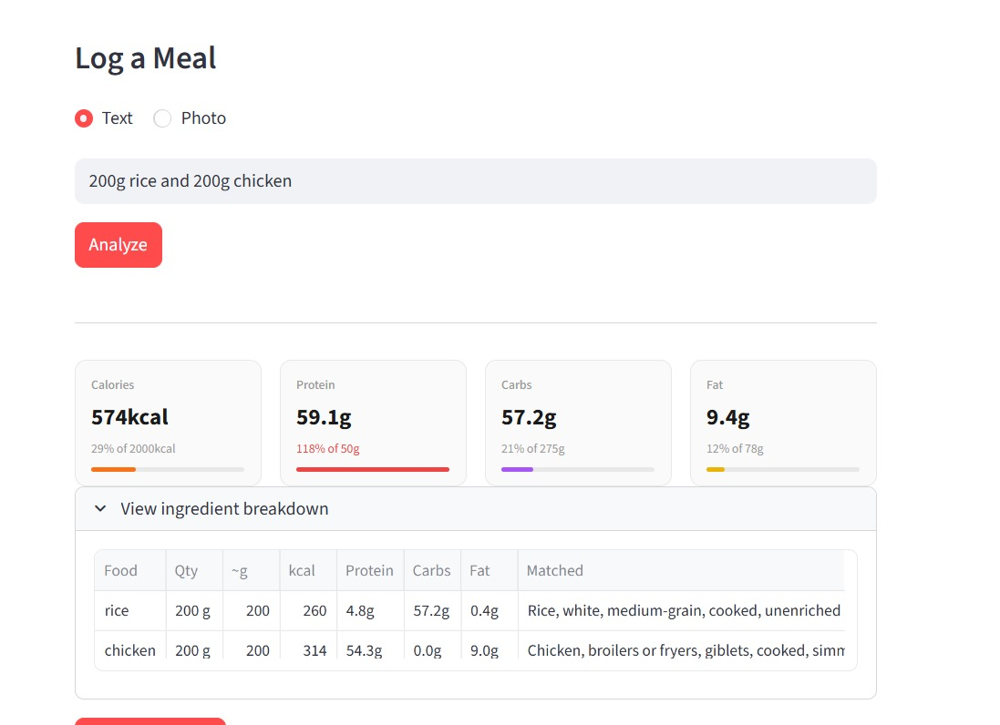
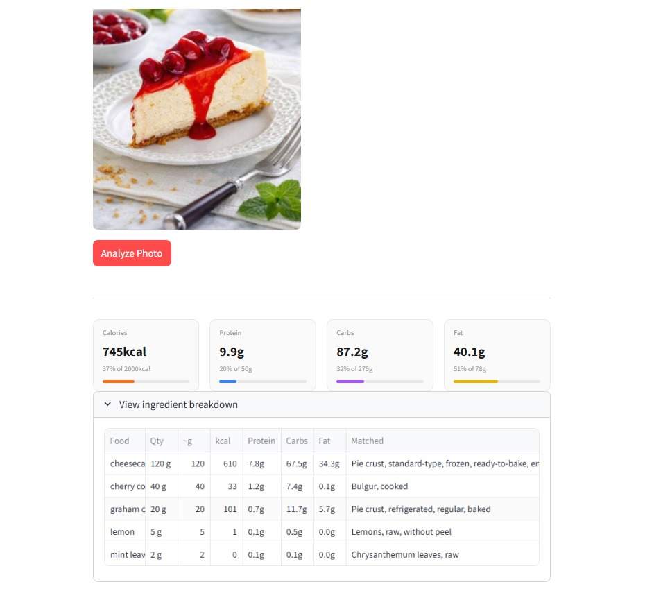
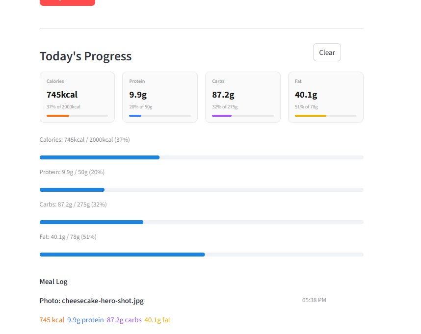
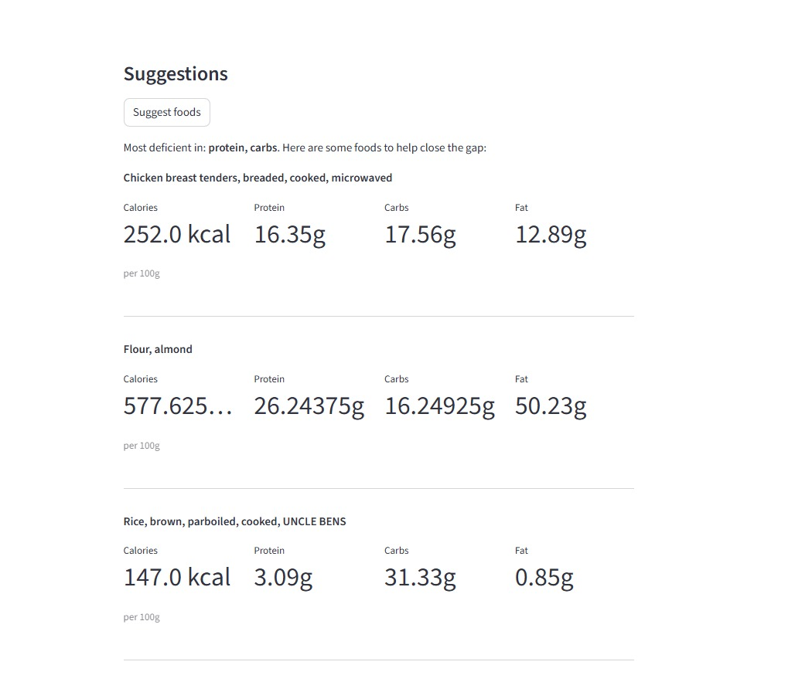

# NutriTrack AI

A Python-based intelligent nutrition tracking application built for CS 5100 — Foundations of Artificial Intelligence at Northeastern University, Spring 2026.

Users log meals through free-text description or photo upload. An AI pipeline analyzes each meal, extracts macronutrient data (calories, protein, carbohydrates, fat), and accumulates a running daily total compared against standard RDI targets. The system also provides intelligent meal suggestions to close identified nutritional gaps.

---

## Screenshots

### Text Meal Logging

*[Screenshot: Text input — "200g rice and 200g chicken" with ingredient breakdown table and macro cards]*

### Photo Meal Logging

*[Screenshot: Photo upload mode showing uploaded meal image and identified ingredients]*

### Daily Dashboard

*[Screenshot: Daily Totals section with color-coded macro cards, RDI progress bars, and timestamped meal log]*

### Suggestions

*[Screenshot: Suggestions panel showing recommended foods based on remaining daily macro gaps]*

---

## AI Subdomains

| Subdomain | Implementation |
|---|---|
| Natural Language Processing | LLM-based structured parsing of free-text meal descriptions → JSON schema; composite dish decomposition (e.g. tiramisu → ingredients) |
| Computer Vision | LLaMA 4 Scout 17B for food identification and gram-level portion estimation from meal photos |
| Knowledge Representation | USDA FoodData Central API as structured food-nutrient knowledge base; LLM-generated search queries for optimal retrieval |
| Planning & Optimization | Gap analysis engine: RDI − daily totals → LLM-generated food queries → USDA lookup → top 3 gap-closing suggestions |

---

## Pipeline

```
Text input
    ↓
LLM parser (LLaMA 3.3 70B)
  - Few-shot prompted for simple foods + composite dish decomposition
  - Outputs: [{name, quantity, unit}]
    ↓

Photo input
    ↓
Vision model (LLaMA 4 Scout 17B)
  - Few-shot prompted with size reference examples
  - Outputs all quantities in grams
    ↓

━━━━━━━━━━━━━━━━━━━━━━━━ (shared pipeline below) ━━━━━━━━━━━━━━━━━━━━━━━━

For each food item:

[Stage 1] LLM search query generation
  - Converts food name → optimal USDA search query
  - e.g. "milk" → "milk whole fluid", "olive oil" → "oil olive"
    ↓
[Stage 2] USDA FoodData Central search
  - Returns top 15 Foundation + SR Legacy candidates
    ↓
[Stage 3] Noise filtering
  - Removes fast food, branded, processed, dried/powdered items
    ↓
[Stage 4] LLM candidate selection
  - Picks best match from top 8 candidates
  - Prefers plain whole ingredients in simplest common form
    ↓
[Stage 5] USDA detail fetch + macro extraction
  - Extracts calories, protein, carbs, fat per 100g
    ↓
[Stage 6] Unit normalisation
  - USDA foodPortions data → grams
  - Falls back to standard generic weights
    ↓
[Stage 7] Macro scaling + aggregation
  - scaled = (grams / 100) × macro_per_100g
  - Sum across all items → meal totals
    ↓
[Stage 8] RDI comparison
  - Daily accumulated totals vs 2000 kcal / 50g protein / 275g carbs / 78g fat
    ↓

Output: macro cards + breakdown table + daily log + suggestions
```

---

## Tech Stack

| Layer | Technology |
|---|---|
| Frontend | Python + Streamlit |
| Text LLM | Groq — LLaMA 3.3 70B Versatile |
| Vision LLM | Groq — LLaMA 4 Scout 17B |
| Nutrition data | USDA FoodData Central API |
| Storage | SQLite via `chat_history.py` (persists across sessions) |
| Evaluation | Python + requests |

---

## Project Structure

```
nutritrack-ai/
├── app.py               # Streamlit frontend (UI + session state)
├── chat_history.py      # SQLite persistence layer (sessions, messages, food log)
├── pipeline.py          # Orchestrates all pipeline stages
├── parser.py            # LLM meal text parser (LLaMA 3.3 70B)
├── vision.py            # Vision model for photo analysis (LLaMA 4 Scout 17B)
├── retrieval.py         # LLM-guided USDA candidate search and selection
├── normalise.py         # Unit normalisation (household units → grams)
├── usda.py              # USDA FoodData Central API helpers
├── suggestions.py       # Gap analysis and food recommendation engine
├── evaluate.py          # Full evaluation script (vision + text pipelines)
├── nutritrack.db        # SQLite database (auto-created on first run)
├── requirements.txt     # Python dependencies
├── nutrition5k_metadata.csv   # Nutrition5k ground truth (not in repo — download separately)
└── .env                 # API keys (not committed)
```

---

## Setup

### Prerequisites

- Python 3.10+
- Groq API key — [console.groq.com](https://console.groq.com) (free tier)
- USDA FoodData Central API key — [fdc.nal.usda.gov/api-guide.html](https://fdc.nal.usda.gov/api-guide.html) (free)

### Installation

```bash
git clone https://github.com/shreyakishor/nutritrack-ai.git
cd nutritrack-ai
pip install -r requirements.txt
```

Create a `.env` file in the project root:

```
GROQ_API_KEY=your_groq_api_key
USDA_API_KEY=your_usda_api_key
```

```bash
python -m streamlit run app.py
```

Open [http://localhost:8501](http://localhost:8501).

### Usage

**Text logging:** Type a meal description (e.g. "2 scrambled eggs with toast and orange juice") and click Analyze. The LLM will automatically decompose composite dishes into ingredients.

**Photo logging:** Switch to Photo mode, upload a meal image, and click Analyze Photo. The vision model identifies foods and estimates gram weights from the overhead view.

**Logging a meal:** After analyzing, select the meal type and click "Log this meal". The meal is saved to the selected date in the SQLite database and the dashboard updates immediately.

**Changing the date:** Use the date picker in the top-right of the main page to view or log meals for any day in the current month. Defaults to today.

**Suggestions:** Once meals are logged, scroll down and click "Suggest foods" to get gap-closing food recommendations based on the selected date's remaining RDI targets.

**Asking about meals:** Open the sidebar ("Ask about meals") to chat with the AI about any logged day. Select one or more dates from the multiselect — the sidebar automatically syncs to whichever date is active in the main page picker. Use the starter-question buttons or type your own question.

---

## Evaluation

### Text Pipeline

Evaluated against a hand-annotated test set of 10 meal descriptions covering simple whole foods, compound inputs, and varied unit types.

| Metric | Result |
|---|---|
| Parsing accuracy | 80.0% |
| Retrieval accuracy | 91.7% |
| Calorie range accuracy (±25%) | 100.0% |
| Protein range accuracy (±25%) | 100.0% |
| Carbohydrate range accuracy (±25%) | 90.0% |
| Fat range accuracy (±25%) | 100.0% |

### Vision Pipeline

Evaluated against 16 full-meal dishes from the [Nutrition5k dataset](https://github.com/google-research/google-research/tree/master/nutrition5k) (Thames et al., CVPR 2021) — overhead RGB images with lab-measured macronutrient ground truth. Dishes were selected by filtering the Nutrition5k metadata to those with ground-truth caloric content exceeding 200 kcal, focusing the evaluation on full meals.

| Macro | MAE | RMSE | MAPE | Range Acc (±25%) |
|---|---|---|---|---|
| Calories | 229.9 kcal | 330.37 kcal | 53.86% | 31.2% |
| Protein | 15.89 g | 21.70 g | 58.42% | 31.2% |
| Carbohydrates | 14.44 g | 19.40 g | 59.20% | 43.8% |
| Fat | 19.35 g | 29.56 g | 139.27% | 6.2% |

**Key findings:**
- Text pipeline achieves near-perfect macro accuracy after LLM-driven search query generation
- Vision pipeline accuracy is fundamentally limited by portion estimation from a single 2D image — fat is the weakest macro (invisible oils/dressings overhead)
- The Nutrition5k paper reports ~146 kcal MAE for a purpose-trained model with depth data; our general-purpose vision LLM achieves 229.9 kcal MAE with RGB only and no task-specific training

### Evaluation Setup

Install dependencies:

```bash
pip install requests python-dotenv
```

Add these variables to your `.env` file:

```
GROQ_API_KEY=your_groq_api_key
USDA_API_KEY=your_usda_api_key
NUTRITION5K_IMAGES_DIR=/path/to/nutrition5k_images
NUTRITION5K_META1=/path/to/dish_metadata_cafe1.csv
NUTRITION5K_META2=/path/to/dish_metadata_cafe2.csv
```

Note: do not wrap paths in quotes.

### Downloading Nutrition5k

```bash
pip install gsutil

# Create images folder
mkdir nutrition5k_images

# Download the 16 evaluation dishes
gsutil -m cp -r gs://nutrition5k_dataset/nutrition5k_dataset/imagery/realsense_overhead/dish_1559844951 nutrition5k_images
gsutil -m cp -r gs://nutrition5k_dataset/nutrition5k_dataset/imagery/realsense_overhead/dish_1560453174 nutrition5k_images
gsutil -m cp -r gs://nutrition5k_dataset/nutrition5k_dataset/imagery/realsense_overhead/dish_1560543755 nutrition5k_images
gsutil -m cp -r gs://nutrition5k_dataset/nutrition5k_dataset/imagery/realsense_overhead/dish_1561662054 nutrition5k_images
gsutil -m cp -r gs://nutrition5k_dataset/nutrition5k_dataset/imagery/realsense_overhead/dish_1561662216 nutrition5k_images
gsutil -m cp -r gs://nutrition5k_dataset/nutrition5k_dataset/imagery/realsense_overhead/dish_1561739238 nutrition5k_images
gsutil -m cp -r gs://nutrition5k_dataset/nutrition5k_dataset/imagery/realsense_overhead/dish_1562008979 nutrition5k_images
gsutil -m cp -r gs://nutrition5k_dataset/nutrition5k_dataset/imagery/realsense_overhead/dish_1562611680 nutrition5k_images
gsutil -m cp -r gs://nutrition5k_dataset/nutrition5k_dataset/imagery/realsense_overhead/dish_1562691032 nutrition5k_images
gsutil -m cp -r gs://nutrition5k_dataset/nutrition5k_dataset/imagery/realsense_overhead/dish_1562963704 nutrition5k_images
gsutil -m cp -r gs://nutrition5k_dataset/nutrition5k_dataset/imagery/realsense_overhead/dish_1563207364 nutrition5k_images
gsutil -m cp -r gs://nutrition5k_dataset/nutrition5k_dataset/imagery/realsense_overhead/dish_1563216717 nutrition5k_images
gsutil -m cp -r gs://nutrition5k_dataset/nutrition5k_dataset/imagery/realsense_overhead/dish_1563468327 nutrition5k_images
gsutil -m cp -r gs://nutrition5k_dataset/nutrition5k_dataset/imagery/realsense_overhead/dish_1563476551 nutrition5k_images
gsutil -m cp -r gs://nutrition5k_dataset/nutrition5k_dataset/imagery/realsense_overhead/dish_1564432238 nutrition5k_images
gsutil -m cp -r gs://nutrition5k_dataset/nutrition5k_dataset/imagery/realsense_overhead/dish_1566920365 nutrition5k_images

# Download metadata
gsutil cp gs://nutrition5k_dataset/nutrition5k_dataset/metadata/dish_metadata_cafe1.csv nutrition5k_metadata.csv
gsutil cp gs://nutrition5k_dataset/nutrition5k_dataset/metadata/dish_metadata_cafe2.csv nutrition5k_metadata2.csv
```

### Running the Evaluation

```bash
python evaluate.py
```

Results are saved to `evaluation_results.json`.

To run text evaluation only, comment out the vision evaluation loop in `main()`.

---

## Features

- **Text meal logging** — describe a meal in natural language; composite dishes (tiramisu, pasta carbonara, pizza) are automatically decomposed into ingredients via few-shot LLM prompting
- **Photo meal logging** — upload a meal photo; vision model identifies foods and estimates gram weights using calibrated few-shot examples
- **Persistent storage** — all meals and chat sessions are saved to a local SQLite database (`nutritrack.db`); data survives page refreshes and app restarts
- **Date picker** — view or log meals for any day within the current month; defaults to today
- **Daily accumulation** — running macro totals with color-coded RDI progress bars for the selected date
- **Meal log** — timestamped history of all meals logged for the selected date, with individual delete and bulk clear
- **Suggestions** — dynamically generated food recommendations targeting your biggest nutritional gaps, selected by LLM from USDA-verified candidates
- **AI meal chat (sidebar)** — ask questions about one or more logged days; the sidebar auto-syncs to the active date picker selection; chat history is persisted per session
- **Rate limit handling** — automatic exponential backoff on Groq API 429 errors

---

## Known Limitations

- Fat estimation from photos is unreliable — oils, dressings, and sauces are visually invisible overhead
- Vision pipeline accuracy improves significantly with depth data (not available in RGB-only setup)
- Groq free tier rate limits (30 req/min) can slow analysis for complex meals with many ingredients
- SQLite database is stored locally — not suitable for multi-user or cloud deployments without replacing the storage layer
- API keys are stored in `.env` — not suitable for public deployment without a backend proxy

---

## Citation

Thames, Q., Karpur, A., Norris, W., Xia, F., Panait, L., Weyand, T., & Sim, J. (2021).
*Nutrition5k: Towards Automatic Nutritional Understanding of Generic Food.*
CVPR 2021. [Paper](https://openaccess.thecvf.com/content/CVPR2021/papers/Thames_Nutrition5k_Towards_Automatic_Nutritional_Understanding_of_Generic_Food_CVPR_2021_paper.pdf)